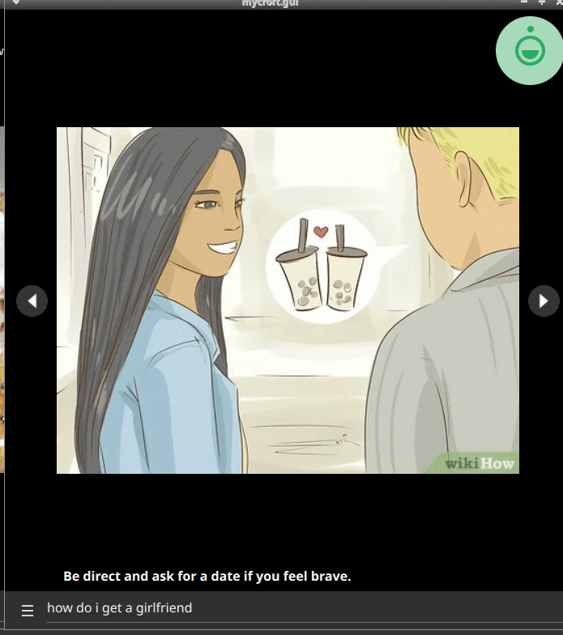
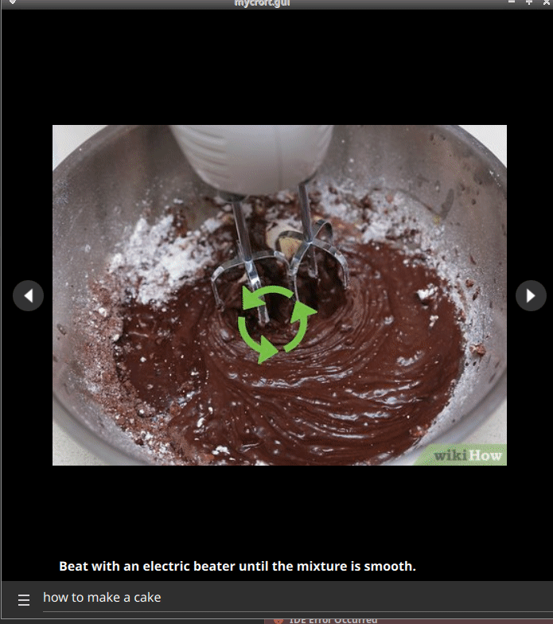

#  WikiHow Skill

How to do nearly everything.

## About
Ever wondered about how to boil an egg, or the best way to brush your teeths. This skill enables
Mycroft to anser a lot of "how to" questions with step by step guide. More detailed
information can be asked afterwods.

Information is comming from [wikihow.com](https://www.wikihow.com/)

## Examples
* "how to boil an egg"
* "give me a random how to"
* "explain better"

# Platform support

- :heavy_check_mark: - tested and confirmed working
- :x: - incompatible/non-functional
- :question: - untested
- :construction: - partial support

|     platform    |   status   |  tag  | version | last tested | 
|:---------------:|:----------:|:-----:|:-------:|:-----------:|
|    [Chatterbox](https://hellochatterbox.com)   | :question: |  dev  |         |    never    | 
|     [HolmesV](https://github.com/HelloChatterbox/HolmesV)     | :question: |  dev  |         |    never    | 
|    [LocalHive](https://github.com/JarbasHiveMind/LocalHive)    | :question: |  dev  |         |    never    |  
|  [Mycroft Mark1](https://github.com/MycroftAI/enclosure-mark1)    | :question: |  dev  |         |    never    | 
|  [Mycroft Mark2](https://github.com/MycroftAI/hardware-mycroft-mark-II)    | :question: |  dev  |         |    never    |  
|    [NeonGecko](https://neon.ai)      | :question: |  dev  |         |    never    |   
|       [OVOS](https://github.com/OpenVoiceOS)        | :question: |  dev  |         |    never    |    
|     [Picroft](https://github.com/MycroftAI/enclosure-picroft)       | :question: |  dev  |         |    never    |  
| [Plasma Bigscreen](https://plasma-bigscreen.org/)  | :question: |  dev  |         |    never    |  

- `tag` - link to github release / branch / commit
- `version` - link to release/commit of platform repo where this was tested

## Credits
- JarbasAI
- [Wikihow](https://www.wikihow.com/)

## Category
**Daily**
**Information**

## Tags
#howto
